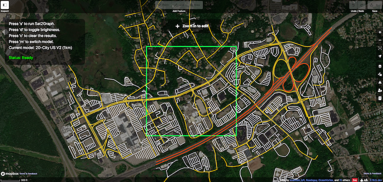

# Sat2Graph 
Sat2Graph: Road Graph Extraction through Graph-Tensor Encoding

Paper: [arxiv.org/pdf/2007.09547.pdf](https://arxiv.org/pdf/2007.09547.pdf) (ECCV 2020)

Talk: [https://www.youtube.com/watch?v=bLw-Ka_SRX8](https://www.youtube.com/watch?v=bLw-Ka_SRX8) (10 minutes)

### Abstract

Inferring road graphs from satellite imagery is a challenging computer vision task. Prior solutions fall into two categories: (1) pixel-wise segmentation-based approaches, which predict whether each pixel is on a road, and (2) graph-based approaches, which predict the road graph iteratively. We find that these two approaches have complementary strengths while suffering from their own inherent limitations. 
 
In this paper, we propose a new method, Sat2Graph, which combines the advantages of the two prior categories into a unified framework. The key idea in Sat2Graph is a novel encoding scheme, graph-tensor encoding (GTE), which encodes the road graph into a tensor representation. GTE makes it possible to train a simple, non-recurrent, supervised model to predict a rich set of features that capture the graph structure directly from an image. We evaluate Sat2Graph using two large datasets. We find that Sat2Graph surpasses prior methods on two widely used metrics, TOPO and APLS. Furthermore, whereas prior work only infers planar road graphs, our approach is capable of inferring stacked roads (e.g., overpasses), and does so robustly.


# Change Log
## 2021-04-12
* Add new global models to our [demo](http://128.30.198.28:8080/#background=Mapbox&disable_features=points,traffic_roads,service_roads,paths,buildings,building_parts,indoor,landuse,boundaries,water,rail,pistes,aerialways,power,past_future,others&map=2.00/13.4/2.6). Now you can run Sat2Graph in a larger window (1km) with the new global models.
* The new models classify the road segments into three categories -- freeway roads, traffic roads and service roads (e.g., parking roads and foot paths). 


## 2021-04-07
* Update the web portal of our [demo](http://128.30.198.28:8080/#background=Mapbox&disable_features=points,traffic_roads,service_roads,paths,buildings,building_parts,indoor,landuse,boundaries,water,rail,pistes,aerialways,power,past_future,others&map=2.00/13.4/2.6).
* Check out our new experimental Sat2Graph model (Still updating)!
<!--  -->


# Run Sat2Graph at any place on Earth! [(Link)](http://128.30.198.28:8080/#background=Mapbox&disable_features=points,traffic_roads,service_roads,paths,buildings,building_parts,indoor,landuse,boundaries,water,rail,pistes,aerialways,power,past_future,others&map=2.00/13.4/2.6).


### **Try Sat2Graph in iD editor [(link)](http://128.30.198.28:8080/#background=Mapbox&disable_features=points,traffic_roads,service_roads,paths,buildings,building_parts,indoor,landuse,boundaries,water,rail,pistes,aerialways,power,past_future,others&map=2.00/13.4/2.6).** **Watch the [demo](https://youtu.be/uqcGPVOBpGg).**


## Instruction
* Use mouse to pan/zoom
* Press 's' to run Sat2Graph (this will take a few seconds)
* Press 'd' to toggle background brightness
* Press 'c' to clear the results
* Press 'm' to switch model

## Supported Models
Model | Note 
--------------------- | -------------
80-City Global  | Trained on 80 cities around the world. This model is 2x wider than the 20-city US model. 
20-City US  | Trained on 20 US cities. This is the model evaluated in our paper. 
20-City US V2 | Trained on 20 US cities at 50cm resolution. This is an experimental model and it performs poorly at places where high resolution satellite imagery is not available. 
Global-V2 | Trained on 80 cities at 50cm resolution. When apply this model to a new place, it takes around 17 seconds for the server to download the images and takes another 30 seconds for inference (1km by 1km). 


# Usage
## Download the Dataset and Pre-Trained Model

```bash
./download.sh
```
This script will download the full 20-city dataset we used in the paper as well as the pre-trained model. It will also download the dataset partition (which tiles are used for training/validating/testing) we used in the paper for SpaceNet Road dataset. 

## Generate outputs from the pre-trained model
**20-city dataset**
```bash
cd model
python train.py -model_save tmp -instance_id test -image_size 352 -model_recover ../data/20citiesModel/model -mode test
```
This command will generate the output graphs for the testing dataset. You can check out the graphs and visualizations in the 'output' folder. 


**SpaceNet dataset**

TODO


## Training Sat2Graph Model
**20-city dataset**

To train the model on the 20-city dataset, use the following command. 
```
python train.py -model_save tmp -instance_id test -image_size 352
```   


**SpaceNet dataset**

TODO


# APLS and TOPO metrics
Please see the 'metrics' folder for the details of these two metrics. 


